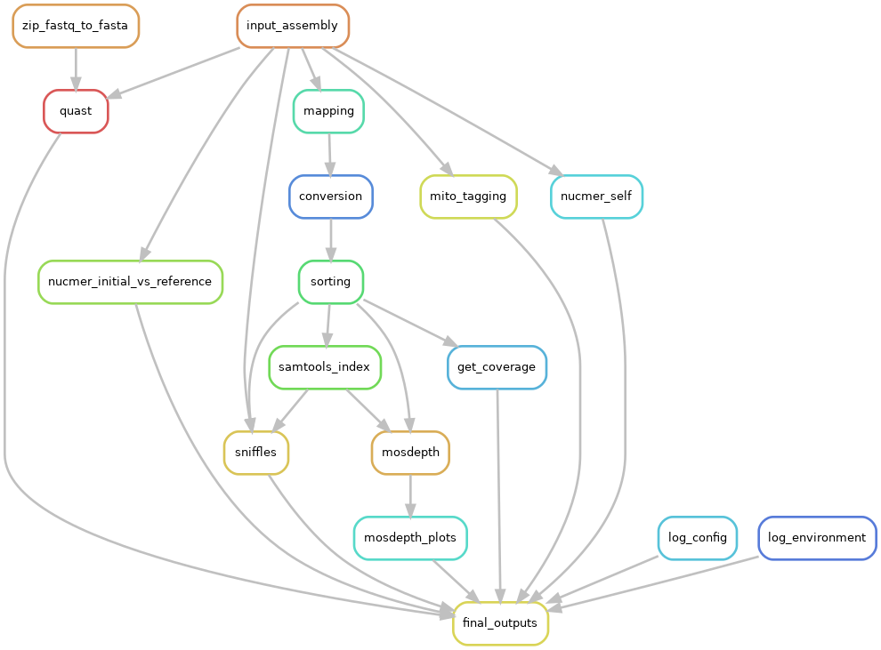

# ASMAPP

## A workflow for appraising genome assemblies. 

### This workflow includes full assembly appraisal with the following methods:  
-Read mapping with minimap2
-Assembly appraisal statistics with QUAST
-Mitochondrial contig flagging/removal  
-Contaminant identification with Blobtools
-Variant calling with Sniffles 
-Mapping stat generation
-Ploidy estimations with Genomescope and Smusdgeplot
-Coverage analytics
-Homoeologous contig detection* 
-Statistics on homoeolog differences*

See the docs for more details.

